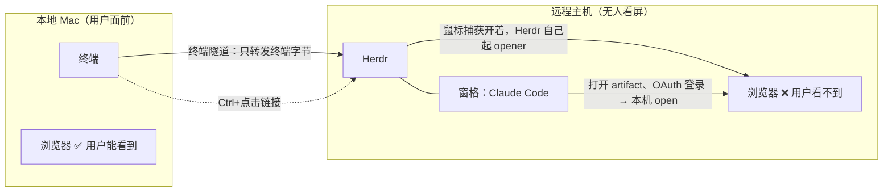
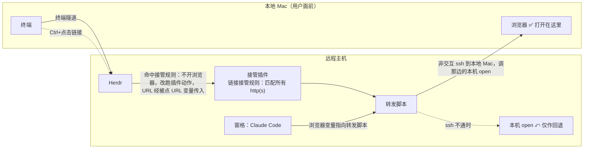
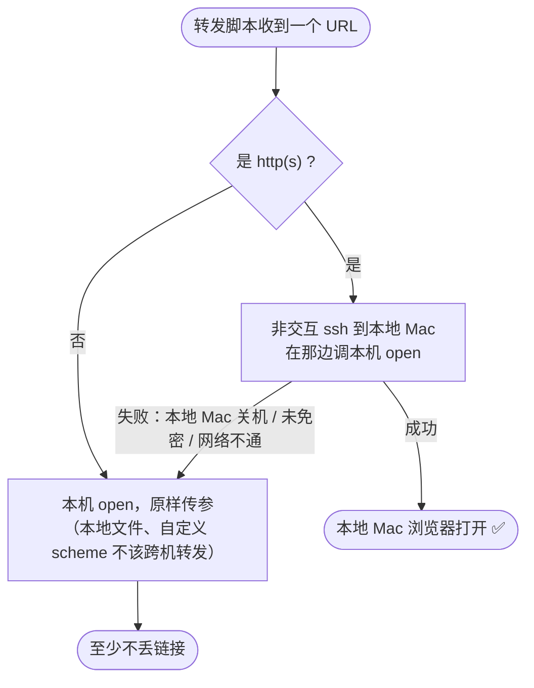

# Handoff：让远程主机上点击的链接在本地 Mac 打开

写于 2026-09-05，来自 `~/github/agents` 会话。读者：在 `~/dotfiles` 里开的新会话。

第 1、2 节只用术语描述架构，不出现文件名。**术语是为阅读方便自拟的中文名，代码、配置、命令里的原名一律在"原名 / 落在哪里"一列**，要动手时回查那一列。第 4 节起才是具体改动。

---

## 1. 术语

### 1.1 两台机器

| 术语 | 指什么 | 在本方案里的位置 |
|---|---|---|
| **本地 Mac** | 用户面前的 MacBook，跑 Ghostty 终端和 mosh 客户端。Tailscale 名 `macbook`，`100.93.81.16` | 链接**应该**在这里打开 |
| **远程主机** | 跑 Herdr 和 Claude Code 的 Mac mini，主机名 `Griffins-MacMini`，Tailscale 名 `macmini`，`100.82.155.5` | 链接**现在**在这里打开，用户看不到 |
| **终端隧道** | 用户从本地 Mac 连到远程主机的通道，抗断线 | 原名 mosh。只转发终端字节流，**不转发"打开浏览器"这类动作**，这是问题的根源 |
| **内网直连** | 两台机器互相可直达的组网 | 原名 Tailscale。远程主机能反向 ssh 回本地 Mac，是整个方案的地基 |

### 1.2 Herdr 侧

| 术语 | 含义 | 原名 / 落在哪里 |
|---|---|---|
| **Herdr** | 远程主机上的终端工作区管理器（0.8.2），角色类似 tmux | 配置 `~/.config/herdr/config.toml` → 符号链接到 `~/dotfiles/config/herdr/config.toml` |
| **窗格** | Herdr 里的一个终端分区，Claude Code 就跑在某个窗格里 | pane |
| **鼠标捕获** | Herdr 吃掉鼠标事件用于自己的界面（点标签页、点侧栏）。**代价**：点击链接也归 Herdr 管，由它决定怎么打开 | 配置键 `ui.mouse_capture`，默认 `true` |
| **链接接管规则** | Herdr 插件的一项声明：**Ctrl+点击**命中正则的 URL 时不打开浏览器，改为执行插件里的一个动作。**本方案的核心机制** | `[[link_handlers]]`（插件清单里的段） |
| **接管触发键** | 上一条的触发键，所有平台（含 macOS）**都是 Control**，不是 Command。原因是终端鼠标上报区分不出 Cmd 与普通点击 | Herdr 硬性设计，不可配置 |
| **插件动作** | 插件里一条可执行命令。是参数数组，**不经过 shell**，没有变量展开，也不该指望 PATH | `[[actions]]`（插件清单里的段） |
| **被点 URL 变量** | 接管规则触发动作时注入的环境变量，值就是被点的那个 URL | `HERDR_PLUGIN_CLICKED_URL`；另有 `HERDR_PLUGIN_LINK_HANDLER_ID`、`HERDR_PLUGIN_CONTEXT_JSON`（含 `clicked_url`、`invocation_source = "link_click"`） |
| **插件登记** | 把一个本地目录登记为插件。只记路径不复制文件，所以插件能住在 dotfiles 里；对当前用户所有 Herdr 会话全局生效，server 不用重启 | `herdr plugin link <dir>`；查看用 `herdr plugin action list --plugin <id>`、`herdr plugin log list --plugin <id>` |

### 1.3 Claude Code 侧

| 术语 | 含义 | 原名 / 落在哪里 |
|---|---|---|
| **本机 open** | macOS 把 URL 交给**本机**默认浏览器的命令。问题就出在"本机"是远程主机 | `/usr/bin/open` |
| **浏览器变量** | Claude Code 打开链接时：设了它就执行 `<它> <url>`，没设就用本机 open。**不改 Claude Code 源码就能改打开方式的唯一入口** | 环境变量 `BROWSER`，本方案在 `~/dotfiles/zshrc` 里按主机名设置 |
| **artifact 列表** | Claude Code 列出已发布 artifact 的界面，`o` 打开、`c` 复制链接 | 命令 `/artifacts` |
| **远程写本地剪贴板** | 一种终端转义序列，让远程程序写**本地** Mac 的剪贴板。Claude Code 检测到 SSH 环境时走这条路而不用本机剪贴板工具，所以 `c` 复制链接理论上能落到本地 Mac（尚未实测） | OSC 52；判据是 `SSH_CONNECTION` |

### 1.4 本方案新增的两样东西

| 术语 | 含义 | 原名 / 落在哪里 |
|---|---|---|
| **转发脚本** | 收一个 URL，通过 ssh 交给本地 Mac 的本机 open；失败则回退到远程主机的本机 open。**两条路径最后都汇到它** | 新增 `~/dotfiles/bin/remote-open` |
| **接管插件** | 一个 Herdr 插件，用链接接管规则拦下所有 http(s) 的 Ctrl+点击，交给转发脚本 | 新增目录 `~/dotfiles/config/herdr/plugins/remote-open/`，含清单与一个入口脚本；插件 id `dotfiles.remote-open` |
| **非交互 ssh** | 禁止密码提示的 ssh 调用方式。脚本里必须用，否则无人值守时会挂起等密码 | `-o BatchMode=yes -o ConnectTimeout=3` |
| **免密配对** | 把远程主机的公钥装到本地 Mac。**要交互输一次对端密码，只有用户能做** | `ssh-copy-id`；公钥 `~/.ssh/id_rsa.pub`；主机别名写在 `~/.ssh/config` |

---

## 2. 架构

### 2.1 现在：两条路都通向看不见的屏幕



两条路径互相独立，各自都得治：Herdr 管的是鼠标点击，Claude Code 管的是它自己发起的打开动作。

### 2.2 目标：两条路都汇进转发脚本



### 2.3 转发脚本的判定



---

## 3. 已核实的事实（含来源）

1. 浏览器变量的行为：macOS 下设了 `BROWSER` 就 `execFile(BROWSER, [url])`，否则走本机 open —— 泄漏源码 `claude-code-mar31/src/utils/browser.ts:44-62`。
2. 远程写本地剪贴板的判据：有 `SSH_CONNECTION` 时不调 `pbcopy` —— `src/ink/termio/osc.ts`。
3. 链接接管规则的语义、Control 触发键、注入的三个环境变量、参数数组不经 shell、同插件内按清单顺序匹配 —— Herdr v0.8.2 文档 `plugins.mdx` 的 "Link handlers" 与 "Commands and environment" 两节。
4. 插件清单写法参照官方示例 `ogulcancelik/herdr-plugin-examples/github-link-preview`（已抓取原文核对）。
5. **Herdr 没有"用哪个命令打开 URL"的配置项**：`herdr --default-config` 里与链接相关的只有鼠标捕获这一个键。所以只能走插件，改配置这条路不存在。
6. 远程主机现状：Herdr 插件目录尚未创建；`~/.ssh/config` 没有本地 Mac 的条目（ssh config 不在 dotfiles 管理内）；本地 Mac 的 Remote Login 已开（22 端口通）；远程主机 → 本地 Mac **尚未免密**（非交互 ssh 返回 Permission denied）。
7. dotfiles 约定：`bin/` 放脚本，`zshrc` 是 `~/.zshrc` 的真身，`claude/CLAUDE.md` 是全局 CLAUDE.md 的真身。不要替用户 commit。

---

## 4. 要改的文件

### 4.1 转发脚本：新增 `bin/remote-open`（`chmod +x`）

```sh
#!/bin/sh
# Open a URL on the Mac that drives this host; fall back to a local open.
# Used as $BROWSER by Claude Code and by the Herdr remote-open plugin.
set -u
url="${1:-}"
host="${REMOTE_OPEN_HOST:-macbook}"

case "$url" in
  http://*|https://*) ;;
  *) exec /usr/bin/open "$@" ;;
esac

if ssh -o BatchMode=yes -o ConnectTimeout=3 -o StrictHostKeyChecking=accept-new \
       "$host" /usr/bin/open "$url" 2>/dev/null; then
  exit 0
fi

exec /usr/bin/open "$url"
```

### 4.2 接管插件清单：新增 `config/herdr/plugins/remote-open/herdr-plugin.toml`

```toml
id = "dotfiles.remote-open"
name = "Remote Open"
version = "0.1.0"
min_herdr_version = "0.7.0"
description = "Ctrl-click any http(s) link to open it on the Mac that drives this session."
platforms = ["macos"]

[[actions]]
id = "open"
title = "Open link on the driving Mac"
command = ["bash", "open.sh"]

[[link_handlers]]
id = "any-http"
title = "Open on the driving Mac"
pattern = "^https?://"
action = "open"
```

### 4.3 接管插件入口：新增 `config/herdr/plugins/remote-open/open.sh`（`chmod +x`）

```sh
#!/usr/bin/env bash
set -euo pipefail
url="${HERDR_PLUGIN_CLICKED_URL:-}"
[ -n "$url" ] || exit 0
exec "$HOME/dotfiles/bin/remote-open" "$url"
```

### 4.4 主机别名：`~/.ssh/config`（不在 dotfiles，手工加）

```
Host macbook
  HostName 100.93.81.16
  User griffin
```

### 4.5 浏览器变量：`zshrc` 追加

```sh
# This host is always driven remotely: route browser opens back to the local Mac.
if [[ "$(hostname -s)" == "Griffins-MacMini" ]]; then
  export BROWSER="$HOME/dotfiles/bin/remote-open"
fi
```

按主机名判断而非 `SSH_CONNECTION`：同一份 dotfiles 也部署在本地 Mac 上，不能影响那边；且终端隧道会话里 `SSH_CONNECTION` 是否存在未验证。

---

## 5. 执行顺序

1. 写 4.1、4.2、4.3 三个文件，两个脚本 `chmod +x`。
2. 登记插件：`herdr plugin link ~/dotfiles/config/herdr/plugins/remote-open`
   验证：`herdr plugin action list --plugin dotfiles.remote-open` 应列出 `open`。
3. 加 4.4 的主机别名，然后**请用户执行** `! ssh-copy-id griffin@100.93.81.16`（要输一次本地 Mac 的密码，agent 做不了）。
   验证：`ssh -o BatchMode=yes macbook true` 静默成功。
4. 加 4.5 的 zshrc 段落。
5. 三项验证，按这个顺序，每项失败都能定位到具体一层：
   - 直接调转发脚本 `~/dotfiles/bin/remote-open https://example.com` → 本地 Mac 打开。失败说明 ssh 或免密没弄好。
   - Herdr 任一窗格里 **Ctrl+点击**一个 https 链接 → 本地 Mac 打开。失败查 `herdr plugin log list --plugin dotfiles.remote-open`。
   - **新开一个 shell**（让浏览器变量生效）启动 Claude Code，`/artifacts` 按 `o` → 本地 Mac 打开。

---

## 6. 注意

- 接管触发键是 **Ctrl+点击**，不是 Cmd+点击。Herdr 的硬性设计，不可配置。
- 接管规则的正则会拦下**所有** http(s) 链接的 Ctrl+点击。若以后想让某些链接仍在远程主机打开，在插件入口脚本里按 URL 分流，不要去改正则（同插件内靠前的规则先匹配，加第二条更绕）。
- 跨机打开要求本地 Mac 有图形登录会话；锁屏时链接会排队到解锁后打开。
- 插件动作不经 shell：插件入口脚本里必须用绝对路径调转发脚本，不能指望 PATH。
- 未采用的备选：关掉鼠标捕获，让点击交还本地终端处理 —— 代价是 Herdr 的鼠标界面整体失效；或在本地 Mac 上开 Tailscale SSH，省掉密钥分发。
- 收尾：在 `claude/CLAUDE.md` 的运行环境一节补一句"浏览器打开已转发到本地 Mac；Herdr 里用 Ctrl+点击"，并把本文件从 `.scratch/` 删掉。
